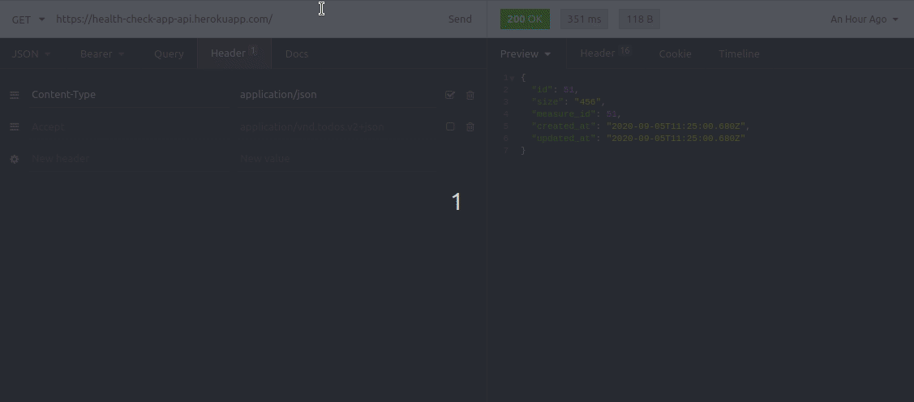
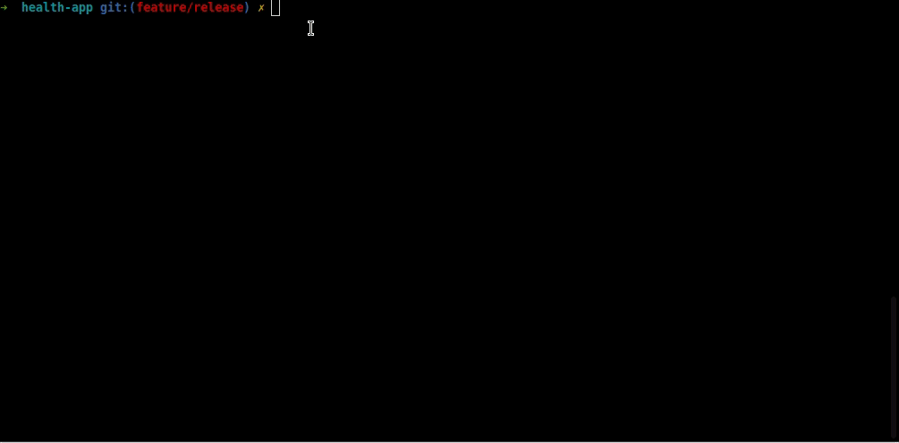
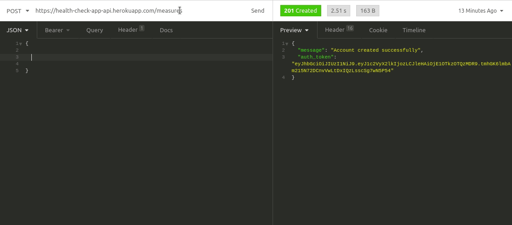
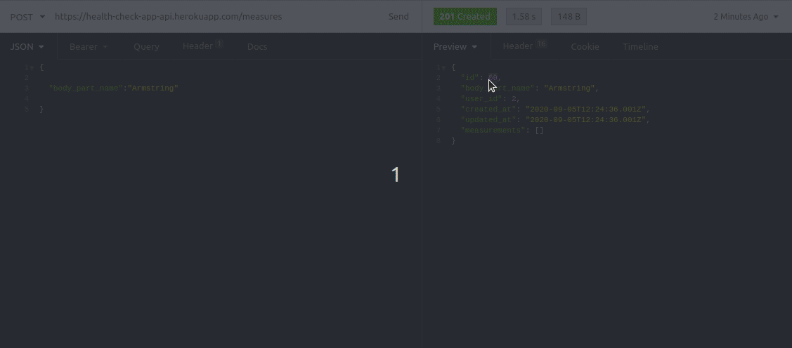
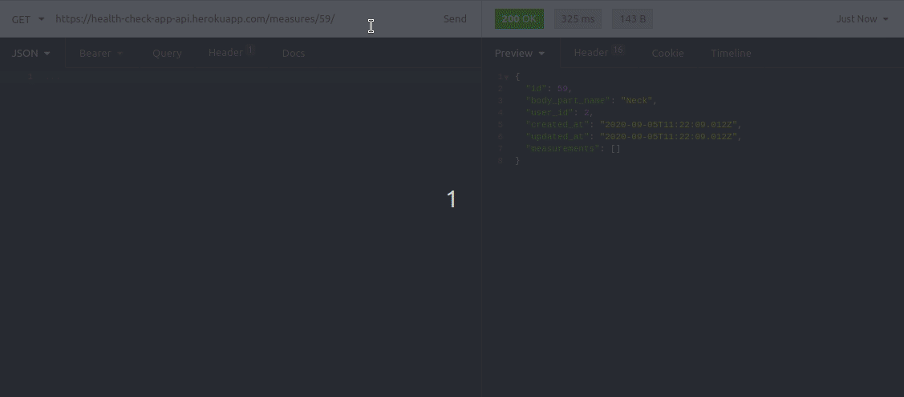
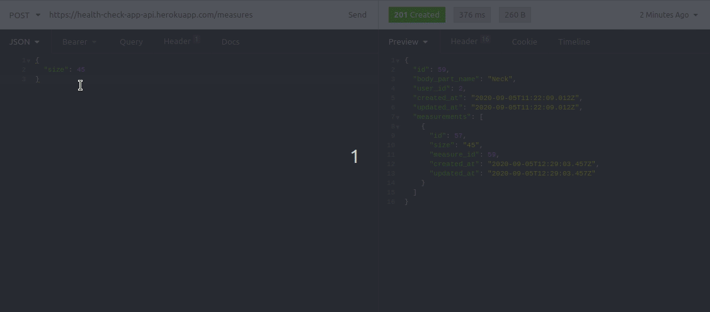

[![Contributors][contributors-shield]][contributors-url]
[![Forks][forks-shield]][forks-url]
[![Stargazers][stars-shield]][stars-url]
[![Issues][issues-shield]][issues-url]

<!-- PROJECT LOGO -->
<br />
<p align="center">
    

  <h3 align="center">Health App API</h3>

  <p align="center">
    A web App created in the fulfillment of Microverse mandatory Ruby on Rails capstone project.
    <br />
    <a href="https://github.com/Cyrus-Kiprop/rails-react-health-app/issues">Report Bug</a>
    ·
    <a href="https://github.com/Cyrus-Kiprop/rails-react-health-app/issues">Request Feature</a>
  </p>
</p>

<!-- TABLE OF CONTENTS -->

## Table of Contents

- [About the Project](#about-the-project)
  - [Api Documentation](#api-documentation)
  - [Built With](#built-with)
- [Getting Started](#getting-started)
  - [Prerequisites](#prerequisites)
  - [Installation](#installation)
- [Usage](#usage)
- [Roadmap](#roadmap)
- [Contributing](#contributing)
- [License](#license)
- [Contact](#contact)
- [Acknowledgements](#acknowledgements)

<!-- ABOUT THE PROJECT -->

## About The Project

A progressive Health Tracking mobile web app. User can utilize the apps' exposed api utility to view and keep track of their fitness levels.


## Api Documentation

Click [ here ](https://afritrend.herokuapp.com/users/sign_in) for a live demo of the app.

### Built With

The project was built using the following languages stacks:

```sh
Back-End(server)
```

- [Ruby -v 2.7.1](https://ruby-doc.org/)
- [Ruby on Rails -v 5.2+](https://rubyonrails.org/)

```sh
Testing Frameworks
```

- shoulda_matchers
- [RSpec](https://rspec.info/)
- Factories gem

<!-- GETTING STARTED -->

## Getting Started

To get a local copy up and running follow these simple example steps.

### Prerequisites

- Ruby -v 2.7.1 -[click here](https://www.ruby-lang.org/en/)

- Rails -v 5.2.4

```sh
gem install rails -v 5.2.4
```

- Postgresql database [click here](https://www.digitalocean.com/community/tutorials/how-to-install-ruby-on-rails-with-rbenv-on-ubuntu-18-04)

### Installation

1. Clone the repo

```sh
git clone https://github.com/Cyrus-Kiprop/rails-react-health-app.git
```

2. CD into the project root directory

```sh
cd ./rails-react-health-app
```

3. Install Dependencies and gems

```sh
bundle install
```

4. Set the databases

```sh
rails db:create
```

5. Create database schemas

```sh
rails db:migrate
```

6. Seed the DB
```sh
 rails db:seed
```

7. Run rspec tests 
```sh
bundle exec rspec
```

<!-- USAGE EXAMPLES -->

## Usage

### Fire up the server:

```JS
rails s
```

### Create a User



### Grant admin rights to the user



### Sign In


### Create Measures (Admin Only)


### Delete Measures (Admin Only)


### Create Measurements


### List all Measures with their measurements


<!-- ROADMAP -->

## Roadmap

See the [open issues](https://github.com/Cyrus-Kiprop/rails-react-health-app/issues) for a list of proposed features (and known issues).

<!-- CONTRIBUTING -->

## Contributing

Contributions are what make the open source community such an amazing place to be learn, inspire, and create. Any contributions you make are **greatly appreciated**.

1. Fork the Project
2. Create your Feature Branch (`git checkout -b feature/NewAwesomeFeature`)
3. Commit your Changes (`git commit -m 'Add some NewAmazingFeature'`)
4. Push to the Branch (`git push origin feature/NewAmazingFeature`)
5. Open a Pull Request

<!-- CONTACT -->

## Contact

Cyrus Kiprop - cyruskiprop254@gmail.com

Project Link: [https://github.com/Cyrus-Kiprop/afriTrend](https://github.com/Cyrus-Kiprop/rails-react-health-app)

## Authors

👤 **Cyrus Kiprop**

- Github: [Cyrus-Kiprop](https://github.com/Cyrus-Kiprop)
- Twitter: [@kipropJS](https://twitter.com/kipropJS)
- Linkedin: [Cyrus Kiprop](https://www.linkedin.com/in/cyrus-kiprop-ba7320120/)

## Acknowledgements

- [Heroku](https://afritrend.herokuapp.com)
- [Best-README-Template](https://github.com/othneildrew/Best-README-Template)

<!-- LICENSE -->

## License

Distributed under the MIT License. See [ LICENSE ](https://github.com/Cyrus-Kiprop/rails-react-health-app/raw/master/LICENSE) for more information.

<!-- MARKDOWN LINKS & IMAGES -->

[contributors-shield]: https://img.shields.io/github/contributors/Cyrus-Kiprop/rails-react-health-app.svg?style=flat-square
[contributors-url]: https://github.com/Cyrus-Kiprop/rails-react-health-app/graphs/contributors
[forks-shield]: https://img.shields.io/github/forks/Cyrus-Kiprop/rails-react-health-app.svg?style=flat-square
[forks-url]: https://github.com/Cyrus-Kiprop/rails-react-health-app/network/members
[stars-shield]: https://img.shields.io/github/stars/Cyrus-Kiprop/rails-react-health-app.svg?style=flat-square
[stars-url]: https://github.com/Cyrus-Kiprop/rails-react-health-app/stargazers
[issues-shield]: https://img.shields.io/github/issues/Cyrus-Kiprop/rails-react-health-app.svg?style=flat-square
[issues-url]: https://github.com/Cyrus-Kiprop/rails-react-health-app/issues
[product-screenshot]: /app/assets/images/screenshot.png
